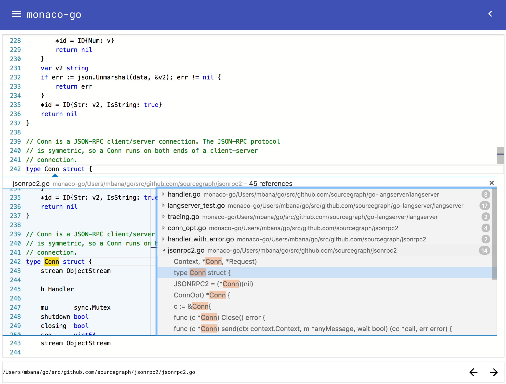
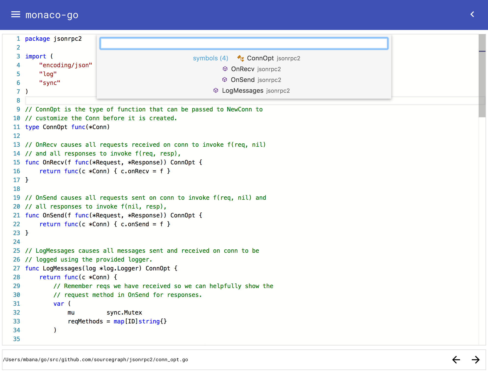
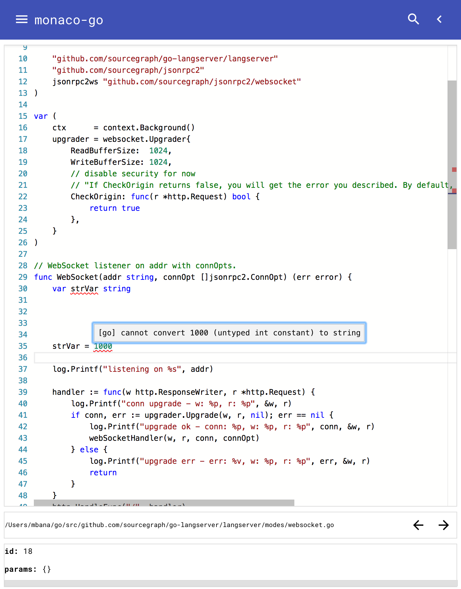
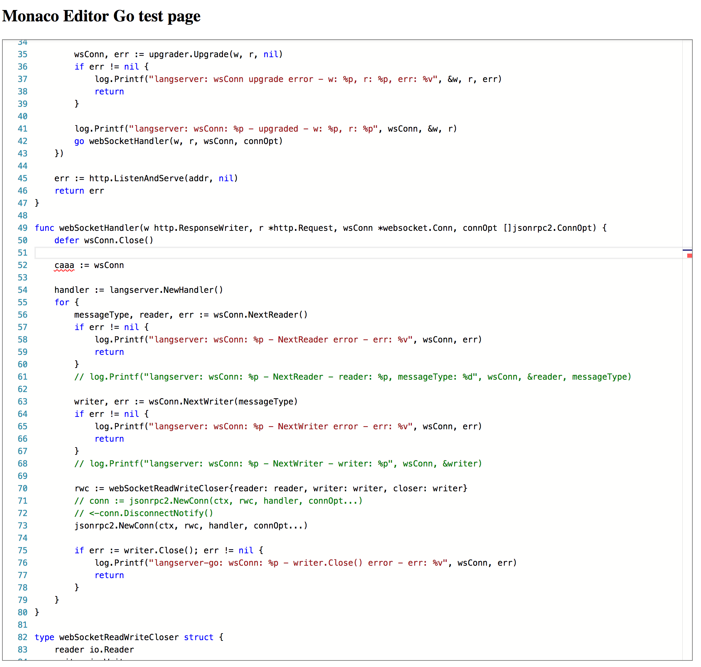

# `monaco-go`

Go lang mode for [monaco-editor](https://github.com/Microsoft/monaco-editor). The implementation is mostly derived from
[monaco-css](https://github.com/Microsoft/monaco-css) but uses WebSocket as the transport to talk to the
[go-langserver](https://github.com/sourcegraph/go-langserver).

WIP but these are partly supported:

* `capabilities.textDocumentSync`
* `textDocument/didChange`
* `textDocument/didClose`
* `textDocument/didOpen`
* `textDocument/hover`
* `textDocument/definition`: going to definition works but navigating back and
forths isn't.
* `textDocument/references`: references are listed, navigating to them however isn't.
* `textDocument/publishDiagnostics`
* `textDocument/documentSymbol`: wip.
* <del>`workspace/symbol`</del>: fairly large feature-set, i think.

See: [Language Server Protocol](https://github.com/Microsoft/language-server-protocol/blob/master/protocol.md).

# demo

### `textDocument/hover`


### `textDocument/definition`


## build

### `Dockerfile`

Execute below to download repo, build and run using Docker:

```sh
( \
	wget -qO- https://raw.githubusercontent.com/mbana/monaco-go/master/build/get.sh | /bin/bash \
) && \
docker run -p 8080:8080 -it monaco-go:latest
```

See [build output](#build-output) for what logs you should expect to see.

### locally

or, although not ideal:

```sh
( \
  REPOS_DIR="/tmp/repos/ghub" && \
  mkdir -p $REPOS_DIR && \
  cd $REPOS_DIR && \
  git clone --recursive git@github.com:mbana/monaco-go.git && \
  cd monaco-go && \
  ./build/all.sh \
)
```

### test

Run as below. See [./src/test/web-socket-reader-test.ts](./src/test/web-socket-reader-test.ts).

```sh
$ npm run test
src/fillers/vscode-nls.ts(6,63): error TS2307: Cannot find module 'vscode-nls'.


  WebSocketMessageReader
    ✓ init msg
    ✓ many msg


  2 passing (9ms)
```

The tests need more work. Some test messages are defined in
[./src/test/messages/messages.ts](./src/test/messages/messages.ts). Once things
become a bit more stable I will add tests for the non-trivial parts.

### build output

The langserver and server hosting monaco should log something, after which
you should access <http://localhost:8080>. The lines which
indicate that connection has been made are the last ones:

```sh
Removing intermediate container a0155ffa6334
Successfully built 467d10dc618e
--------
run commands:
docker run -p 8080:8080 -p 4389:4389 -it monaco-go:855a815
docker run -p 8080:8080 -p 4389:4389 -it monaco-go:latest
~/dev/vscode/mbana/monaco-go $ docker run -p 8080:8080 -p 4389:4389 -it monaco-go:latest
langserver: websocket listening on: :4389

> monaco-go@1.2.1 serve /root/monaco-go
> http-server -c-1 --utc -o

Starting up http-server, serving ./
Available on:
  http://127.0.0.1:8080
  http://172.17.0.3:8080
Hit CTRL-C to stop the server
...
[Thu, 15 Dec 2016 01:38:38 GMT] "GET /demo/monaco-go.js" "Mozilla/5.0 (Macintosh; Intel Mac OS X 10_11_6) AppleWebKit/537.36 (KHTML, like Gecko) Chrome/54.0.2840.98 Safari/537.36"
...
langserver-go: wsConn upgrading - w: 0xc4200619f0, r: 0xc4200ea0f0
langserver: wsConn: 0xc420077440 - upgraded - w: 0xc4200619f0, r: 0xc4200ea0f0
langserver: wsConn: 0xc420077440 - NextReader - reader: 0xc420061a40, messageType: 1
langserver: wsConn: 0xc420077440 - NextWriter - writer: 0xc420061a50
--> request #0: initialize: {"rootPath":"/Users/mbana/go/src/github.com/sourcegraph/go-langserver/langserver","capabilities":{"dynamicRegistration":true,"workspace":{"applyEdit":true},"textDocument":{"willSaveNotification":true,"willSaveWaitUntilRequest":true}},"initializationOptions":{"rootImportPath":"github.com/sourcegraph/go-langserver/langserver","GOPATH":"/Users/mbana/go","GOROOT":"/usr/local/opt/go/libexec"},"trace":"messages"}
...
<-- result #0: initialize: {"capabilities":{"textDocumentSync":1,"hoverProvider":true,"definitionProvider":true,"referencesProvider":true,"documentSymbolProvider":true,"workspaceSymbolProvider":true}}
```

## screenshots

### `textDocument/references`



### `textDocument/documentSymbol`



### `textDocument/publishDiagnostics`

Errors are highlighted in the margins and inline, at error site, within model:





### `textDocument/definition`

**todo** 


### `textDocument/hover`


## References

* [`monaco-editor`](https://github.com/Microsoft/monaco-editor).
* [`vscode-css-languageservice`](https://github.com/Microsoft/vscode-css-languageservice).
* [`monaco.d.ts`](https://github.com/Microsoft/monaco-css/blob/master/src/monaco.d.ts).
* [Visual Studio Code](https://github.com/Microsoft/vscode).

* `build`: [/build/README.md](/build/README.md).
* `Dockerfile`: [/build/docker/README.md](/build/docker/README.md).

## License

[MIT](https://github.com/Microsoft/monaco-css/blob/master/LICENSE.md)